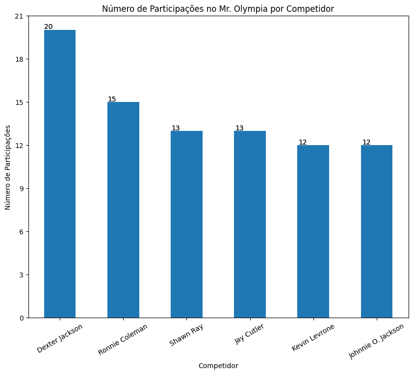
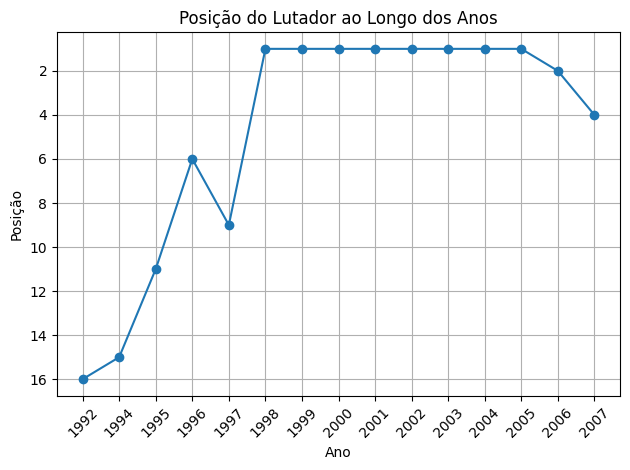
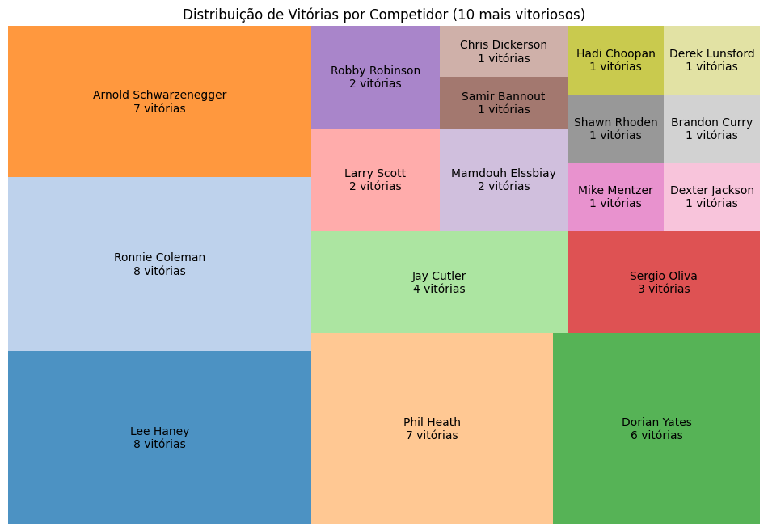
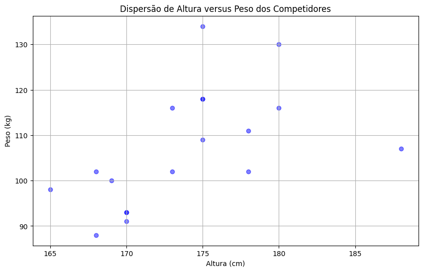
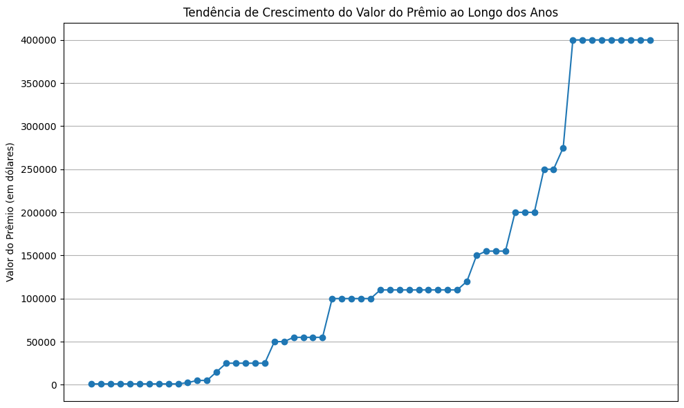
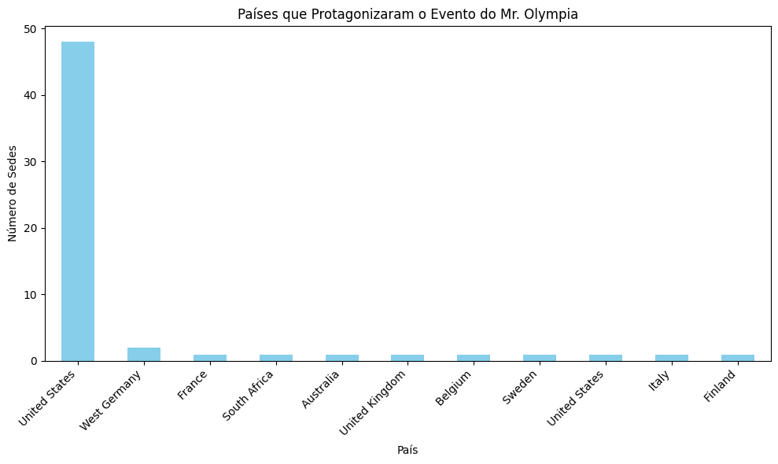

# MrOlympia DataAnalysis

[English Version](README_EN.md)

## Introdução
O projeto MrOlympia-DataAnalysis tem como objetivo realizar a extração de dados (web scraping) da Wikipédia sobre os vencedores do Mr. Olympia na categoria Open Division. A partir desses dados, buscamos extrair informações interessantes e criar visualizações que permitam uma melhor compreensão dos padrões e tendências ao longo dos anos.

## Tecnologias Utilizadas
Para o desenvolvimento deste projeto, utilizamos as seguintes tecnologias:

* **pandas**: para manipulação e análise de dados.
* **requests**: para fazer requisições HTTP e obter o conteúdo das páginas web.
* **BeautifulSoup4**: para fazer o parsing do HTML e extrair os dados relevantes.
* **matplotlib**: para a criação de gráficos e visualizações.
Estrutura do Projeto
O projeto consiste em quatro grandes partes:

1. **Scraping Data from Wikipedia**
Nesta parte, implementamos toda a lógica de web scraping para obter dados do site da Wikipédia sobre o Mr. Olympia e seus participantes. Os dados coletados são armazenados em listas.

2. **Create DataFrame**
Após a coleta dos dados, armazenamos essas informações em dataframes utilizando a biblioteca pandas. Isso facilita a manipulação e análise dos dados.

3. **Get Data of Each Olympia**
Nesta seção, criamos dataframes específicos para cada edição do Mr. Olympia, incluindo informações detalhadas sobre os participantes, como peso e altura.

4. **Display Data in Graphs**
Utilizamos o matplotlib para criar gráficos interativos e visualizações que ajudam a entender os dados coletados. Alguns dos gráficos gerados incluem:

## Alguns dos dados observados foram:

## Conclusão
O projeto MrOlympia-DataAnalysis permitiu obter insights interessantes sobre os vencedores e os padrões do Mr. Olympia ao longo dos anos. Algumas das descobertas incluem a evolução do valor dos prêmios, a performance de competidores notáveis como Ronnie Coleman, e a distribuição dos eventos por país.

Possíveis extensões do projeto podem incluir a análise de outras categorias do Mr. Olympia, a inclusão de dados mais recentes, e a criação de visualizações interativas utilizando bibliotecas como Plotly ou Bokeh.
